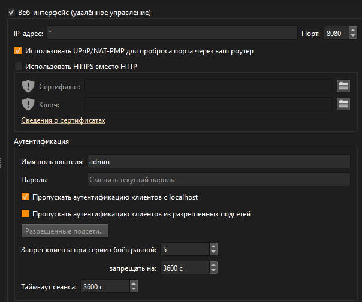
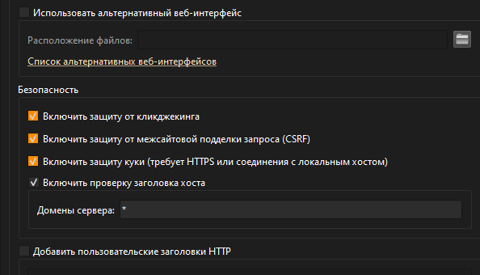

# autoupdate-torrents
Автообновление торрентов с rutracker


# Создание cookies.json
Создайте файл ```cookies.json``` в директории с остальным файлами
Пример файла:
```
{
  "bb_session": "value",
  "bb_ssl": "1",
  "opt_js": "value",
  "bb_guid": "value"
}
```
Замените ```value``` на свои значения:
1. Войдите в свой аккаунт на https://rutracker.org в браузере.
2. Откройте инструменты разработчика (F12).
3. Перейдите во вкладку "Network" (Сеть).
4. Обновите страницу (F5) и найдите запрос к "rutracker.org" (например, viewtopic.php или index.php).
5. В разделе "Request Headers" найдите строку "Cookie: " и скопируйте все куки (формат: name1=value1; name2=value2; ...).
6. Преобразуйте их в JSON-объект (как на примере, будте аккуратны).
7. Сохраните в файл в той же папке, что и скрипт.
Важно: Куки имеют срок действия, так что обновляйте их периодически, если скрипт перестает работать.
Если куки неверные, запросы к Rutracker вернут ошибку авторизации.

# Настройка qBittorrent
Переходите в настройки > веб-интерфейс


Имя пользователя: ```admin```
Пароль: ```adminadmin```

Остальные настройки:



Для проверки работоспособности перейдите на сайт: ```http://127.0.0.1:8080/``` Появляется интерфейс, входим, если вход успешен, то всё работает (страницу можно закрыть)

# Краткий гайд по программе
1. Запускаете ```management.py```
2. В интерфейсе первая строка отвечает за ссылку на раздачу в формате: ```https://rutracker.org/forum/viewtopic.php?t=```, на конце цифры раздачи (кнопка справа: вставить из буфера обмена)
3. Вторя строка это путь к файлу, можно вписать или нажать на 3 точки и выбрать директорию, в которую будет скачиваться файл торрента
4. Кнопка "Добавить", добовляет ссылку и путь с конфиг (после добавления раздачи автоматическа загрузка не происходит, нажмите на "Обновить")
5. Кнопка "Обновить", обновляет раздачи из конфига
6. Логи, в них отображается происходящее


