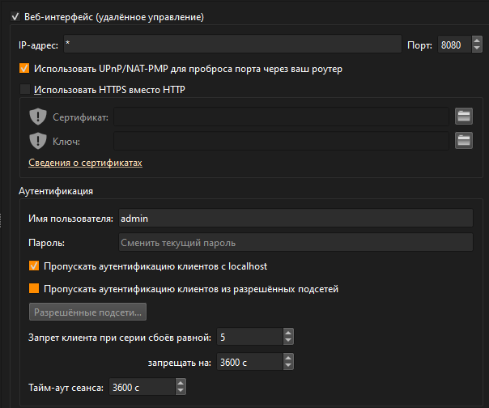
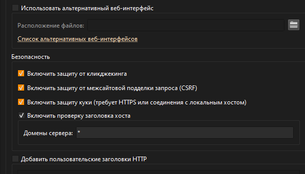

# autoupdate-torrents

Автообновление торрентов с **rutracker.org** в **qBittorrent** — версия для **CachyOS / Arch Linux**
со **встроенным обходом блокировок**.

Приложение следит за списком раздач и по команде (или по расписанию systemd) скачивает свежие
`.torrent` и отправляет их в qBittorrent, поэтому раздачи не «замерзают» без сидов.
Если rutracker заблокирован провайдером, запросы автоматически уходят через прокси
[Антизапрета](https://antizapret.prostovpn.org) — тот же список блокировок использует расширение
«Обход блокировок Рунета» для Firefox. Расширение и браузер при этом не нужны: обход встроен в программу.

```
┌────────────────────────┐      .torrent      ┌──────────────┐
│ rutracker.org (PAC)    │ ─────────────────► │ qBittorrent  │
│  напрямую / через прокси│                    │  Web API     │
└────────────────────────┘                    └──────────────┘
```

## Что изменилось по сравнению с прежней (Windows) версией

| Было | Стало |
|------|-------|
| Файлы рядом со скриптами | XDG-каталоги (`~/.config`, `~/.cache`, `~/.local/share`) |
| Трей только под Windows | Трей под Linux (KDE Plasma, XFCE, GNOME + AppIndicator) |
| Только GUI | GUI + CLI (`--update`, `--check`, `--import-cookies`, …) |
| Нет обновления по расписанию | Пользовательский таймер systemd |
| Прямые запросы к rutracker | Обход блокировок через PAC-скрипт Антизапрета + резервный прокси |
| Конфиг из одного файла рядом с программой | Тот же формат, но в `~/.config/autoupdate-torrents` (старые файлы переносятся автоматически) |

## Установка

### Вариант 1. Скрипт установки (рекомендуется)

```bash
git clone https://github.com/Vastre0/autoupdate-torrents.git
cd autoupdate-torrents
./install.sh                 # зависимости из pacman + venv + ярлык в меню
# ./install.sh --with-timer  # сразу настроить ежедневное обновление
# ./install.sh --autostart   # автозапуск окна при входе в систему
```

Скрипт поставит из репозиториев `python-pyqt6`, `python-requests`, `python-beautifulsoup4`,
создаст venv в `~/.local/share/autoupdate-torrents/venv` и положит ярлык `~/.local/bin/autoupdate-torrents`.

### Вариант 2. PKGBUILD (AUR/makepkg)

```bash
git clone https://github.com/Vastre0/autoupdate-torrents.git && cd autoupdate-torrents
makepkg -si          # или: paru -S autoupdate-torrents, если пакет опубликован в AUR
```

### Вариант 3. Вручную

```bash
sudo pacman -S python-pyqt6 python-requests python-beautifulsoup4
paru -S python-qbittorrent-api     # клиент qBittorrent (есть только в AUR)
python -m venv --system-site-packages ~/.local/share/autoupdate-torrents/venv
~/.local/share/autoupdate-torrents/venv/bin/pip install --no-deps .
```

Необязательно: `python-pysocks` (для SOCKS5-прокси, например Tor), `libnotify` (уведомления в `--update`).

## Быстрый старт

### 1. Куки rutracker

1. Войдите в аккаунт на <https://rutracker.org> в браузере.
2. `F12` → вкладка **Сеть** (Network) → `F5` → выберите запрос к `rutracker.org`.
3. В разделе **Request Headers** скопируйте строку `Cookie:` целиком.
4. В приложении: **«Импорт куки из буфера»**. Или из терминала:

```bash
autoupdate-torrents --import-cookies "bb_session=...; bb_ssl=1; opt_js=...; bb_guid=..."
```

Куки сохранятся в `~/.config/autoupdate-torrents/cookies.json` (права 600) и со временем истекают —
тогда просто повторите шаги.

### 2. qBittorrent

Настройки → **Веб-интерфейс**: включить, логин `admin`, пароль `adminadmin`
(или свои — их можно указать в приложении: **Настройки → qBittorrent**).




Проверка: <http://127.0.0.1:8080/> должен открываться.

### 3. Раздачи

1. **Ссылка:** `https://rutracker.org/forum/viewtopic.php?t=1234567` (кнопка 📋 вставляет из буфера).
2. **Папка:** куда qBittorrent складывает файлы раздачи.
3. **«Добавить в отслеживание»**, затем **«Обновить все торренты»**.

Дальше достаточно периодически нажимать «Обновить все торренты» или включить таймер systemd (см. ниже).

## Обход блокировок

Обход работает так же, как расширение «Обход блокировок Рунета» для Firefox:

1. Приложение скачивает PAC-скрипт Антизапрета (зеркала:
   `antizapret.prostovpn.org:8443`, `:18443`, `e.cen.rodeo:8443`, …) и кэширует его в
   `~/.cache/autoupdate-torrents/pac` (по умолчанию обновление раз в 12 часов).
2. PAC-скрипт разбирается нативно в Python: LZP-сжатые списки доменов, база заблокированных
   IP и подсетей, словари подстановок.
3. Для каждого запроса программа решает, нужен ли прокси: если хост есть в списке —
   запрос идёт через прокси Антизапрета, если нет — напрямую.
4. Если запрос «напрямую» оборвался (типичный признак блокировки у провайдера), он
   автоматически повторяется через прокси.

Проверить решение по конкретному хосту:

```bash
autoupdate-torrents --check-host rutracker.org
autoupdate-torrents --check-host rutracker.org --no-bypass   # сравнить с прямым доступом
```

> **Важно.** Списки Антизапрета отдаются только по российским IP-адресам: если вы за границей,
> сервер вернёт «Your geoip is not RU». В этом случае укажите свой прокси (см. ниже) или
> включите VPN на время обновления PAC.

### Свой прокси / Tor

Если PAC недоступен или нужен собственный маршрут:

```bash
autoupdate-torrents --set-proxy socks5://127.0.0.1:9050   # Tor
autoupdate-torrents --set-proxy http://127.0.0.1:8118     # Privoxy
```

Или в приложении: **Настройки → Обход блокировок → Резервный прокси**.
Для SOCKS5 нужен пакет `python-pysocks` (`sudo pacman -S python-pysocks`).

Полностью отключить обход: `--no-bypass` (или снять галочку в настройках).

## Командная строка

```bash
autoupdate-torrents                     # графический интерфейс (по умолчанию)
autoupdate-torrents --update            # разово обновить все раздачи (код возврата 0/1)
autoupdate-torrents --update --notify   # + уведомление рабочего стола
autoupdate-torrents --check             # диагностика: куки, qBittorrent, PAC, rutracker
autoupdate-torrents --list              # список отслеживаемых раздач
autoupdate-torrents --refresh-pac       # перекачать PAC-скрипт
autoupdate-torrents --check-host HOST   # нужен ли прокси для хоста
autoupdate-torrents --import-cookies -  # куки из stdin
autoupdate-torrents --set-qbittorrent localhost:8080 admin adminadmin
autoupdate-torrents --print-paths       # используемые каталоги
autoupdate-torrents --install-service   # таймер systemd (systemctl --user)
autoupdate-torrents --enable-autostart  # автозапуск при входе в сессию
```

## Расписание и автозапуск

```bash
autoupdate-torrents --install-service
systemctl --user list-timers autoupdate-torrents.timer
journalctl --user -u autoupdate-torrents.service -n 50
```

Таймер обновляет раздачи ежедневно в 04:30 (со случайным разбросом ±30 минут) и догоняет
пропущенный запуск после выключенного компьютера. Всё настраивается в
**Настройки → Система**, шаблоны unit-файлов лежат в `extras/`.

## Файлы и каталоги

| Что | Где |
|-----|-----|
| Куки rutracker | `~/.config/autoupdate-torrents/cookies.json` |
| Список раздач | `~/.config/autoupdate-torrents/torrent_config.json` |
| Настройки | `~/.config/autoupdate-torrents/user-config.json` |
| Кэш PAC-скрипта | `~/.cache/autoupdate-torrents/pac/` |
| venv (при установке скриптом) | `~/.local/share/autoupdate-torrents/venv` |

Файлы старой версии (`cookies.json`, `torrent_config.json`, `user-config.json` рядом со скриптами)
переносятся в XDG-каталог при первом запуске.

## Если что-то не работает

| Симптом | Что делать |
|---------|------------|
| «Куки rutracker.org не найдены» | Импортировать строку Cookie (см. выше) |
| «Похоже, куки недействительны» | Куки истекли — обновите их |
| «Не удалось скачать PAC-скрипт» | Проверьте интернет; `--check-host`; при геоблокировке задайте свой прокси |
| `--update` падает с ошибкой qBittorrent | Включите веб-интерфейс qBittorrent и проверьте хост/пароль в настройках |
| `ModuleNotFoundError: qbittorrentapi` | `paru -S python-qbittorrent-api` или `pip install --user qbittorrent-api` |
| SOCKS5-прокси не работает | `sudo pacman -S python-pysocks` |
| Нет иконки в трее (GNOME) | Установите расширение *AppIndicator and KStatusNotifierItem Support* |
| Торрент добавляется, но не качается | Проверьте путь сохранения и права на папку |

Подробная диагностика: `autoupdate-torrents --check`.

## Разработка

```
torrent_manager/
├── antizapret.py   # разбор PAC: LZP, списки домен/IP, определение «нужен прокси»
├── bypass.py       # загрузка/кэш PAC, выбор маршрута, резервный прокси
├── torrents.py     # rutracker (с обходом) и qBittorrent Web API
├── service.py      # прикладная логика (используют GUI и CLI)
├── cli.py          # командный интерфейс
├── config.py       # настройки (XDG)
├── cookies.py      # куки rutracker
├── torrent_store.py# список отслеживаемых раздач
├── integration.py  # автозапуск и таймер systemd
├── gui/            # PyQt6: окно, настройки, трей
└── data/           # иконки и стили
tests/              # unittest: PAC, обход, сервис, CLI, GUI (headless)
```

```bash
python -m unittest discover -v            # все тесты
QT_QPA_PLATFORM=offscreen python -m unittest tests.test_gui_smoke
python -m torrent_manager                 # запуск из репозитория
```

Тесты не обращаются к сети: PAC-скрипт генерируется в формате Антизапрета
(`tests/pac_fixture.py`), включая LZP-сжатие, словари подстановок и base36-дельты IP.

## Благодарности

* [antizapret / prostovpn.org](https://antizapret.prostovpn.org) — PAC-скрипты и списки блокировок.
* [anticensority/runet-censorship-bypass](https://github.com/anticensority/runet-censorship-bypass)
  («Обход блокировок Рунета», GPL-3.0) — формат PAC-скрипта, который реализован здесь нативно.
* [antizapret-pac-generator-light](https://bitbucket.org/anticensority/antizapret-pac-generator-light) —
  генератор PAC (LZP-сжатие, схема `domains`, `d_ipaddr`, `special`).

Приложение использует эти списки только для доступа к контенту, который вам доступен по закону;
ответственность за использование — на пользователе.
